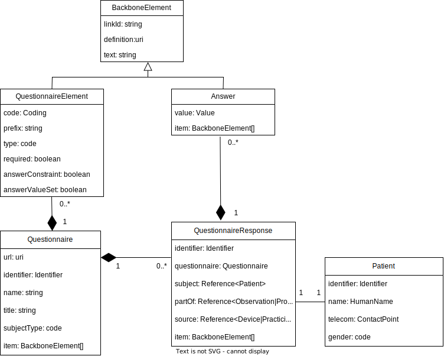

# mm_patient

This repository contains the code base for the interview challenge 'Questionnaire - Patient'.
Data for many patients are to be collected in the registry. However, there must always be a Patient Consent for the collection of the data. No forms may be displayed before this.
 
Within one time point a predefined set of questionnaires should be displayed.
There are differences in this set, depending on whether it is the first time point (baseline) or a subsequent time point (follow-up).

## Task 1 


The following UML diagramm describes the how the Ressources [Questionnaires](https://www.hl7.org/fhir/questionnaire.html), [QuestionnaireResponses](https://build.fhir.org/questionnaireresponse.html) and [Patient](https://build.fhir.org/patient.html) are related. To simplify the diagram, only attributes that support the understanding of those classes are included.



## Design process

To  define the requirements a [figma file](https://www.figma.com/file/xEu9OCRoDs0ONJ4JHoJXVo/mm_patient?type=design&node-id=4%3A484&mode=design&t=Hh2R5MlU82oOpN17-1) was created. In this file a first design draft for the questionnaire tool is defined. 


The tool should show at the beginning which points in time exist.
The user of the tool should now select whether a baseline should be created or a follow-up.
Thereupon, all questionnaires of the new time point are listed. 
Here it must be checked whether the consent is available, before further questionnaires are displayed.

The next step was to create a class diagramm which is inspired by the FHIR standard but not implements it fully. 


The current implementation does not represent [QuestionnaireResponse](https://build.fhir.org/questionnaireresponse.html).


## Recommended IDE Setup

- [VSCode](https://code.visualstudio.com/) 
- [Volar](https://marketplace.visualstudio.com/items?itemName=Vue.volar) (and disable Vetur) 
- [TypeScript Vue Plugin (Volar)](https://marketplace.visualstudio.com/items?itemName=Vue.vscode-typescript-vue-plugin)
- [Todo Tree](https://marketplace.visualstudio.com/items?itemName=Gruntfuggly.todo-tree)


## Project Setup

```sh
npm install
```

### Compile and Hot-Reload for Development

```sh
npm run dev
```

### Type-Check, Compile and Minify for Production

```sh
npm run build
```

## Tech stack
- vue.js: ^3.3.4
- json-server: ^0.17.4
- vuetify: ^3.3.21

## Open issues

- How to assign consent to patient
    - Possibility 1: Embed solution in to EHR and assign entire workflow
    - Possibility 2: Add text field to 'Check consent' view
- Add relational database
- Persist QuestionnaireResponses
- Transform test data to FHIR ressources
- According to FHIR, the subject of the [Consent Ressource](https://build.fhir.org/consent.html) can not only be applied to the Patient (current state of app), but also Practioner, Group
- Object context is strongly simplified. Work with [FHIR UsageContext](https://build.fhir.org/metadatatypes.html#UsageContext)
- Instead of modelling, timeslot-timeslotType-questionnaire relationship with [useContext](https://build.fhir.org/questionnaire-definitions.html#Questionnaire.useContext), nested [QuestionnaireItems](https://build.fhir.org/questionnaire-definitions.html#Questionnaire.item) could be possible. To discuss
- Improve performance of filter function (getQuestionnaireElementsByQuestionnaireId) by implementing proper server
- Open Datepicker onButtonClick
- Add unit tests
- Improve style